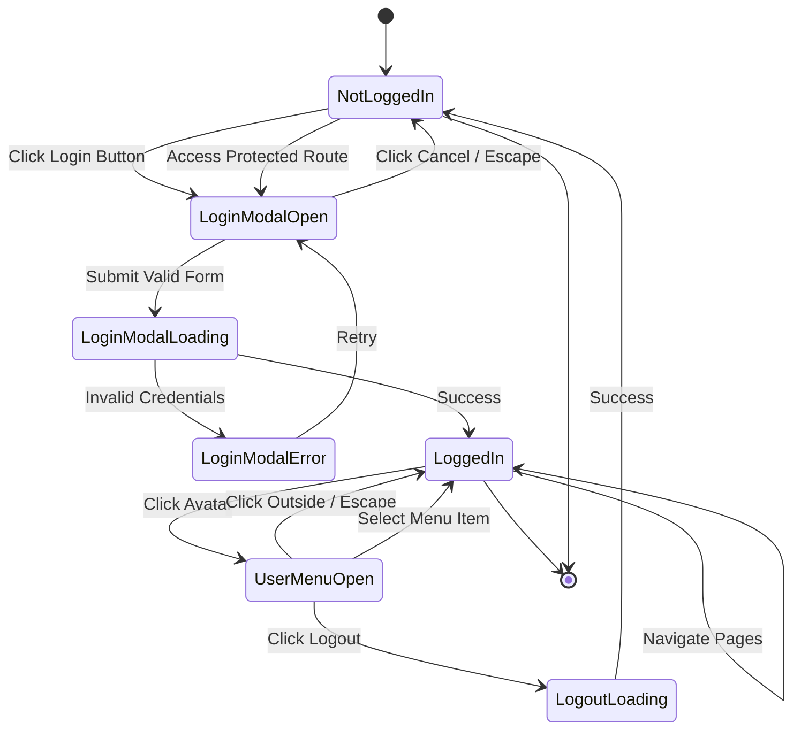

# INT-AUTH-001: Authentication Interaction Flow

**Interaction ID:** INT-AUTH-001  
**Feature:** User Authentication  
**Related Story:** ST-014  
**Status:** Draft  
**Last Updated:** 2026-02-04

---

## Overview

This document defines all user interactions, state transitions, and system behaviors for the authentication flow including login, logout, and session management.

---

## State Diagram



---

## Interaction Flows

### 1. Login Flow (Happy Path)

**Trigger:** User clicks "Login" button in header

**Steps:**
1. **User Action:** Click "Login" button
2. **System:** Open login modal with fade-in animation (200ms)
3. **System:** Focus on email input field
4. **User Action:** Enter email address
5. **System:** Validate email format on blur
6. **User Action:** Enter password
7. **System:** Validate password length on blur
8. **User Action:** (Optional) Check "Remember me"
9. **User Action:** Click "Login" button
10. **System:** Validate all fields
11. **System:** Show loading state (spinner on button, disable inputs)
12. **System:** Call `POST /api/auth/login` with credentials
13. **API:** Return success with user data and token
14. **System:** Store auth data in localStorage
15. **System:** Close modal with fade-out animation (150ms)
16. **System:** Update header to show user avatar
17. **System:** Redirect to intended page (or dashboard if none)
18. **System:** (Optional) Show success toast: "Welcome back, [Name]!"

**Duration:** ~2-3 seconds total

---

### 2. Login Flow (Error Path)

**Trigger:** User submits invalid credentials

**Steps:**
1-11. *(Same as happy path)*
12. **System:** Call `POST /api/auth/login` with credentials
13. **API:** Return error (401 Unauthorized)
14. **System:** Hide loading state
15. **System:** Show error message: "Invalid email or password"
16. **System:** Add shake animation to modal (300ms)
17. **System:** Add red border to email and password fields
18. **System:** Focus on email field
19. **User Action:** Correct credentials and retry

**Duration:** ~1-2 seconds for error display

---

### 3. Protected Route Access (Not Logged In)

**Trigger:** User navigates to `/inventory` without auth

**Steps:**
1. **User Action:** Click link or type URL to protected route
2. **System:** Middleware detects no auth session
3. **System:** Store intended route in session storage
4. **System:** Open login modal automatically
5. **System:** Update modal title: "Login Required"
6. **System:** Add subtitle: "Please log in to access Manage Inventory"
7. **User Action:** Complete login flow
8. **System:** After successful login, redirect to stored intended route
9. **System:** Clear stored route from session storage

**Duration:** Depends on user login time

---

### 4. User Menu Interaction

**Trigger:** User clicks avatar in header

**Steps:**
1. **User Action:** Click user avatar
2. **System:** Open dropdown menu with fade-in + slide-down (150ms)
3. **System:** Position dropdown aligned to right edge of avatar
4. **User Action:** Hover over menu items
5. **System:** Highlight hovered item (bg-accent)
6. **User Action:** Click menu item (e.g., "Manage Inventory")
7. **System:** Close dropdown
8. **System:** Navigate to selected page

**Alternative:** Click outside or press Escape to close without action

**Duration:** Instant (150ms animation)

---

### 5. Logout Flow

**Trigger:** User clicks "Logout" in user menu

**Steps:**
1. **User Action:** Click "Logout" menu item
2. **System:** Show loading spinner on logout item
3. **System:** Disable other menu items
4. **System:** Call `POST /api/auth/logout`
5. **API:** Invalidate session token
6. **System:** Clear localStorage auth data
7. **System:** Close dropdown
8. **System:** Update header to show "Login" button
9. **System:** Redirect to homepage (`/`)
10. **System:** (Optional) Show toast: "You have been logged out"

**Duration:** ~1 second

---

### 6. Session Expiry Handling

**Trigger:** User's session expires while browsing

**Steps:**
1. **System:** Detect expired token on API call
2. **API:** Return 401 Unauthorized
3. **System:** Clear localStorage auth data
4. **System:** Update header to show "Login" button
5. **System:** Show modal: "Your session has expired. Please log in again."
6. **System:** Store current route as intended route
7. **User Action:** Log in again
8. **System:** Redirect to stored route after login

**Duration:** Depends on user action

---

## Form Validation Rules

### Email Field
| Rule | Message | Trigger |
|------|---------|---------|
| Required | "Email is required" | On submit if empty |
| Valid format | "Please enter a valid email" | On blur if invalid |

### Password Field
| Rule | Message | Trigger |
|------|---------|---------|
| Required | "Password is required" | On submit if empty |
| Min length (6) | "Password must be at least 6 characters" | On blur if too short |

### Form-Level Validation
- Both fields must be valid to enable submit
- Submit button disabled if validation fails
- Error messages appear below respective fields

---

## API Endpoints

### Login
```typescript
POST /api/auth/login

Request:
{
  email: string
  password: string
  remember: boolean
}

Response (Success):
{
  user: {
    id: string
    name: string
    email: string
    avatar?: string
  }
  token: string
  expiresAt: string
}

Response (Error):
{
  error: "Invalid credentials" | "Account locked" | "Server error"
}
```

### Logout
```typescript
POST /api/auth/logout

Headers:
Authorization: Bearer {token}

Response:
{
  success: true
}
```

### Check Session
```typescript
GET /api/auth/me

Headers:
Authorization: Bearer {token}

Response (Success):
{
  user: {
    id: string
    name: string
    email: string
    avatar?: string
  }
}

Response (Error - 401):
{
  error: "Unauthorized"
}
```

---

## LocalStorage Schema

### Auth Data
```typescript
interface AuthData {
  user: {
    id: string
    name: string
    email: string
    avatar?: string
    initials: string
  }
  token: string
  expiresAt: string // ISO date string
  remember: boolean
}

// Stored as:
localStorage.setItem('auth', JSON.stringify(authData))
```

### Session Validation
```typescript
function isSessionValid(): boolean {
  const auth = JSON.parse(localStorage.getItem('auth') || '{}')
  if (!auth.token || !auth.expiresAt) return false
  return new Date(auth.expiresAt) > new Date()
}
```

---

## Animations & Transitions

### Login Modal
- **Open:** Fade in overlay (200ms) + scale up modal (200ms, ease-out)
- **Close:** Fade out overlay (150ms) + scale down modal (150ms, ease-in)
- **Error:** Shake animation (300ms, 3 shakes)

### User Menu Dropdown
- **Open:** Fade in (150ms) + slide down 8px (150ms, ease-out)
- **Close:** Fade out (100ms)

### Header State Change
- **Login → Logout:** Fade out Login button (150ms) → Fade in Avatar (150ms)
- **Logout → Login:** Fade out Avatar (150ms) → Fade in Login button (150ms)

---

## Error Handling

### Network Errors
```typescript
catch (error) {
  if (error.code === 'NETWORK_ERROR') {
    showError('Connection failed. Please check your internet.')
  } else if (error.code === 'TIMEOUT') {
    showError('Request timed out. Please try again.')
  } else {
    showError('Something went wrong. Please try again later.')
  }
}
```

### Validation Errors
- Display inline below respective field
- Red border on invalid field
- Clear error on field change

### API Errors
- Display in modal header or below form
- Specific messages for known errors
- Generic message for unknown errors

---

## Keyboard Shortcuts

| Key | Action | Context |
|-----|--------|---------|
| Tab | Navigate fields | Login modal |
| Enter | Submit form | Login modal (when focused on input) |
| Escape | Close modal | Login modal |
| Escape | Close dropdown | User menu |
| Arrow Down/Up | Navigate items | User menu |
| Enter | Select item | User menu |

---

## Accessibility Requirements

### Focus Management
- Login modal: Focus on email field when opened
- User menu: Focus on first item when opened
- Modal close: Return focus to trigger button

### Screen Reader Announcements
- "Login modal opened"
- "Logging in..." (loading state)
- "Login successful" or "Login failed: [error]"
- "Logged out successfully"

### ARIA Attributes
```tsx
// Login Modal
<Dialog role="dialog" aria-labelledby="login-title" aria-modal="true">
  <DialogTitle id="login-title">Login to Your Account</DialogTitle>
</Dialog>

// User Menu
<DropdownMenu>
  <DropdownMenuTrigger aria-label="User menu" aria-haspopup="true">
  <DropdownMenuContent role="menu">
    <DropdownMenuItem role="menuitem">User Profile</DropdownMenuItem>
  </DropdownMenuContent>
</DropdownMenu>
```

---

## Performance Considerations

- Login modal component lazy-loaded (not in initial bundle)
- Avatar images optimized and cached
- Auth state checked on mount (single API call)
- Token refresh handled in background (if implemented)

---

## Security Considerations

- Passwords never stored in localStorage
- Tokens have expiration time
- HTTPS required for all auth endpoints
- CSRF protection on API endpoints
- Rate limiting on login attempts (server-side)

---

## Related Documents

- [ST-014: User Authentication Flow](../../features/container-auction-mvp/po/usd/ST-014.md)
- [WF-AUTH-001: Authentication Wireframe](../stage1-wireframes/WF-AUTH-001-authentication-flow.md)
- [COMP-AUTH-001: Login Modal](../stage2-component-specs/COMP-AUTH-001-login-modal.md)
- [COMP-AUTH-002: User Menu](../stage2-component-specs/COMP-AUTH-002-user-menu.md)
